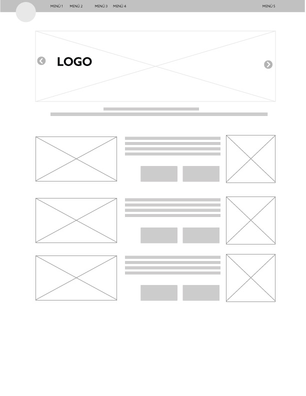
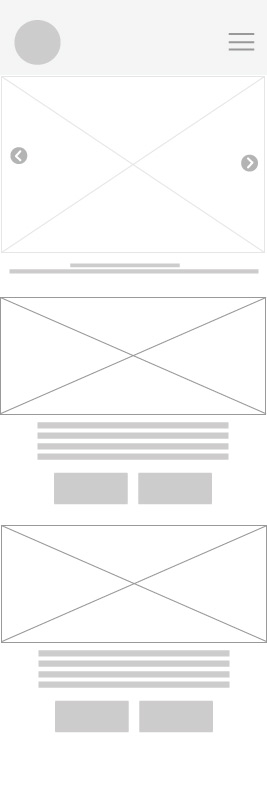
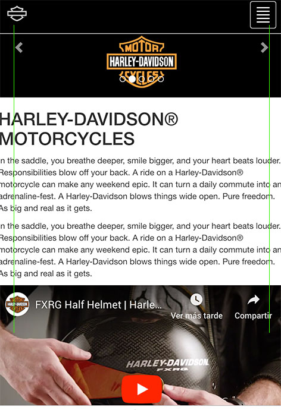

# Prueba-Final - Etapa 1 

1. Sitio HARLEY DAVIDSON
2. INDEX
+ Menú sticky. 
+ Slider . 
+ iframe-Video. 
+ Elementos destacados. 
2. ABOUT US
+ Banner desktop y Mobile utilizando <source media="">
+ Utlización de col-md
3. OWNERS.
+ Clase Bootstrap - class="list-group
4. PARTS & APPAREL
5. EVENTS
+ Js contador
6. RENT A BIKE
+ Carousel generico Bootstrap
7. CONTAC US
* Form Bootstrap
* GoogleMap. 

***

<dl>
  <dt>WIREFRAME</dt>
  <dd>Completas las vistas</dd>

  <dt>Documentar el HTML</dt>
  <dd>Uso *appi* en el **html**<em>tags</em>.</dd>
</dl>

###Referencias

> "Sitio oficial HD", [Link](https://www.harley-davidson.com/us/en/motorcycles/2019/softail/breakout.html)
> "Harley-Davidson Santiago Chile", [Link](https://www.h-dsantiago.cl/)
> "Imágene contenidas ref", [Link](https://www.harley-davidson.com/content/dam/h-d/images)

***

<!-- 
⋅⋅⋅You can have properly indented paragraphs within list items. Notice the blank line above, and the leading spaces (at least one, but we'll use three here to also align the raw Markdown).

⋅⋅⋅To have a line break without a paragraph, you will need to use two trailing spaces.⋅⋅
⋅⋅⋅Note that this line is separate, but within the same paragraph.⋅⋅
⋅⋅⋅(This is contrary to the typical GFM line break behaviour, where trailing spaces are not required.)
-->
* Link directo a los contenidos
###Links

[INDEX](quienes-somos.html)
[ABOUT US](servicios.html)
[OWNERS](accesorios.html)
[PARTS & APPAREL](noticias.html)
[EVENTS](noticias.html)
[RENT A BIKE](rent.html)
[CONTAC US](contacto.html)
***

Wireframe - página 1

	

	

***

Prueba-Final - Etapa 2 - maqueta HTML  6:53pm
Pruebas Mobile  

	

